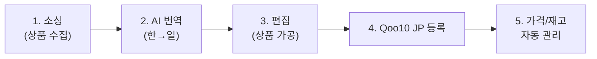

# DayZero B2C 솔루션 설명

<aside>
📣

## Description

이 문서는 **DayZero B2C 솔루션의 전체 구조와 기능**을 설명합니다.
크롬 익스텐션 개발 시 DayZero가 어떤 서비스인지, 어떤 파이프라인 위에서 동작하는지 이해하기 위해 참조하세요.
**핵심**: 역직구 자동화 솔루션 — 소싱 → AI 번역 → Qoo10 JP 등록 → 가격/재고 자동 관리

</aside>

## 🎯 DayZero란

### 한 줄 요약

**DayZero**는 INVAIZ가 운영하는 **역직구(한국→일본) 자동화 솔루션**입니다. 한국 쇼핑몰에서 상품을 수집하여, AI로 일본어 번역하고, Qoo10 JP에 자동 등록한 뒤, 가격/재고를 자동으로 관리합니다.

### B2B vs B2C

| **구분** | **DayZero B2B (기존)** | **DayZero B2C (현재 MVP)** |
| --- | --- | --- |
| 타겟 | 연매출 300억+ 엔터프라이즈 고객 | 역직구 개인 셀러 (위탁/구매대행) |
| 기술 | RPA 데스크탑 앱 (Windows/macOS) | 웹앱 SaaS (Vercel 배포) |
| 마켓 | Shopee, BUYMA, Qoo10, eBay 등 다중 | **Qoo10 JP** (1차 MVP) |
| 실적 | 도입 2주 만에 매출 1,000만원 추가 달성 사례 | MVP 개발 중 (2026.03~) |

## 🔄 핵심 파이프라인

### 전체 흐름



### 1단계: 소싱 (상품 수집)

셀러가 한국 쇼핑몰에서 판매할 상품을 찾아 DayZero에 수집하는 단계.

**수집 방식 3가지**:

- **직접 수집 (URL 입력)**: 쇼핑몰 상품 URL을 직접 붙여넣기
- **직접 수집 (크롬 익스텐션)**: 쇼핑몰 페이지에서 원클릭 수집 ← **지금 개발하려는 기능**
- **자동 수집**: 지원 쇼핑몰의 인기 상품/카테고리를 매일 자동으로 수집 (스케줄 설정)

**수집 시 가져오는 데이터**:

- 상품명, 가격(원가/할인가), 이미지, 옵션, 배송비, 무게 등
- DayZero Automation API가 각 쇼핑몰별 크롤링 처리

**지원 쇼핑몰** (Automation API 기준):

| **쇼핑몰** | **카테고리 수집** | **상품 상세** | **구매 자동화** | **비고** |
| --- | --- | --- | --- | --- |
| 올리브영 | ✅ | ✅ | ✅ (단일/다중) | 보안 방지로 100초+ 소요 |
| 쿠팡 | ✅ | ✅ | ✅ |  |
| 다이소몰 | ✅ | ✅ | ✅ (단일/다중) | 박스 단위 구매 지원 |
| 네이버 스마트스토어 | ✅ | ✅ | ✅ | 캡차 인증 가능성 |
| G마켓 | ✅ | ✅ | ✅ | 그룹 구매 미지원 |
| Yes24 | ✅ | ✅ | ✅ (단일/다중) | 도서/CD/DVD 등 |
| 알라딘 | ✅ | ✅ | ✅ | 도서 전문 |
| Ktown4u | ✅ | ✅ | ✅ | K-POP 굿즈 |
| Weverse Shop | ✅ | ✅ | ✅ | 아이돌 굿즈 |
| Makestar | ✅ | ✅ | ✅ | 아이돌 굿즈 |
| FANS | ✅ | ✅ | ✅ (단일/다중) | 아이돌 굿즈 |
| Witchform | ✅ | ✅ | ✅ | 창작 굿즈/동인 |

### 2단계: AI 번역 (한→일)

수집된 상품의 상품명, 상세 설명을 **AI(LLM)로 자동 번역**합니다.

- 수집 즉시 자동 번역 실행 (다소 시간 소요)
- 셀러가 번역 결과를 수정 가능 (Two-Way Door)
- MVP의 **A-ha Moment** — "AI가 실제로 가치를 만드는 순간"을 1건 만에 체감

### 3단계: 편집 (상품 가공)

번역된 상품을 Qoo10 JP 등록 전에 셀러가 최종 편집하는 단계.

**편집 항목**:

- 상품명 (일본어)
- 상세 설명 (일본어)
- 가격 설정 (마진율 기반 자동 계산)
- 이미지 (썸네일, 상세 이미지)
- 카테고리 매핑
- 배송비 설정

**화면 구조** (기능 명세서 기준):

- ED-01: 편집 목록 (전체 / 번역 필요 / 편집 완료)
- ED-02: 상품 편집 상세 (통합 편집 / 썸네일 AI / 상세페이지 AI)

### 4단계: Qoo10 JP 등록

편집 완료된 상품을 **Qoo10 JP에 자동 등록**합니다.

- Qoo10 JP Seller API 연동
- 한 번에 여러 상품 일괄 등록 가능
- 등록 결과 화면 (성공/실패 표시)
- **등록 후 수정도 가능** (Q10 JP API로 상세 페이지, 이미지 포함 수정 — 픽투셀 대비 차별점)

### 5단계: 가격/재고 자동 관리

등록 후 상품의 가격과 재고를 **자동으로 모니터링하고 조치**합니다.

**핵심 기능**:

- **품절 감지 → 자동 판매 중지**: 원래 쇼핑몰에서 품절되면 Qoo10 JP에서 자동 판매 중지
- **원가 변동 → 자동 가격 조정**: 원가가 변동되면 설정된 마진 기준에 맞춰 판매가 자동 조정

<aside>
⭐

**최대 차별화 기능**: 이 자동 관리 기능은 다른 솔루션(픽투셀 등)에는 없는 **DayZero만의 독보적 기능**입니다. UT에서 가장 강한 긍정 반응을 받았으며, PMF 검증의 핵심 축입니다.

</aside>

## 🏗️ 기술 아키텍처

### 웹앱 (B2C 프론트엔드)

- **배포**: Vercel (`dayzerob2c.vercel.app`)
- **소스**: `dayzero-app/` 디렉토리
- **프로토타입 기반**: 바이브 코딩(Claude Code)으로 제작한 프로토타입에서 실서비스로 전환 중

### DayZero Automation API (백엔드)

쇼핑몰 크롤링, 구매 자동화 등 핵심 자동화를 담당하는 API.

- **Base URL**: `https://dayzero-api.invaiz.com/v1/automation-client/run/{ID}`
- **인증**: `x-api-key` 헤더
- **모든 요청**: POST 메서드
- **비동기 처리**: 구매 등 장시간 작업은 Queue 등록 → Webhook으로 결과 수신

**API 카테고리**:

| **카테고리** | **기능** | **예시 ID** |
| --- | --- | --- |
| 카테고리 수집 | 쇼핑몰별 전체/개별 카테고리 상품 리스트 조회 | `oliveyoung-all-categories`, `coupang-one-category` |
| 상품 상세 | 개별 상품의 옵션, 가격, 재고, 이미지 추출 | `oliveyoung-product-detail`, `coupang-product-detail` |
| 구매 자동화 | 상품 자동 구매 (PG 결제 포함) | `oliveyoung-order`, `coupang-order` |

### Qoo10 JP 연동

- Qoo10 JP Seller API를 통한 상품 등록/수정
- 가격/재고 동기화를 위한 정기 스케줄링
- Q10 API 스파이크 (기술 검증) 선행 완료 필요

## 📱 웹앱 IA (Information Architecture)

### 전체 화면 구조

```
DayZero B2C
├── 0. 공통 (Global)
│   ├── G-01  GNB (글로벌 네비게이션)
│   └── G-02  시스템 알림
│
├── 1. 온보딩/초기 셋팅
│   ├── S-01  로그인/회원가입
│   ├── S-02  Qoo10 JP API 연동
│   ├── S-03  배송지/기본 정보
│   └── S-04  마진/배송비 설정
│
├── 2. 소싱
│   ├── SC-01 소싱 홈 (자동화 현황)
│   ├── SC-02 URL 입력 수집 ← 크롬 익스텐션이 연동되는 화면
│   ├── SC-03 자동 수집 설정
│   └── SC-04 수집 진행/결과
│
├── 3. 편집 (상품 가공)
│   ├── ED-01 편집 목록 (전체·번역 필요·편집 완료)
│   └── ED-02 상품 편집 상세
│       ├── ED-02a 통합 편집
│       ├── ED-02b 썸네일 AI 설정
│       └── ED-02c 상세페이지 AI 설정
│
├── 4. 등록 (ED-01/ED-02에서 직접 등록)
│   └── RG-02 등록 결과
│
├── 5. 내 상품
│   ├── PM-01 등록 상품 목록
│   ├── PM-02 상품 상세 (등록 후)
│   └── PM-03 싱크 관리 (변동/역마진/설정)
│
└── 6. 설정
    ├── ST-01 계정 관리
    ├── ST-02 Qoo10 연동 관리
    ├── ST-03 소싱/등록 기본 설정
    └── ST-04 알림 설정
```

<aside>
📌

**크롬 익스텐션 연동 지점**: SC-02 (URL 입력 수집) 화면이 익스텐션과 직접 연동됩니다. 익스텐션에서 수집한 URL이 이 화면의 태그 목록에 표시되고, 여기서 "수집 시작하기"를 클릭하면 DayZero의 수집 파이프라인이 실행됩니다.

</aside>

## 💰 비즈니스 모델

### 타겟 사용자

- **1차 타겟**: 위탁/구매대행 경험이 있는 한국 온라인 셀러
- **마켓**: Qoo10 JP (1차) → Qoo10 SG, Shopee 등 (확장)
- **파트너**: 온꿈사(투플렉스, 역직구 교육 유튜버) — 사용자 모집 경로 확보

### 가격 정책

- 사전 신청 시 기본 30%, 최대 50% 할인
- 가격/재고 자동 확인: 최대 10건 (무료 플랜 기준)
- 랜딩 페이지: [dzero.run](http://dzero.run)

### 핵심 지표 (북극성)

- **7-Day Retention Rate** (등록 후 재방문)
- Activation Rate (첫 수집 성공률)
- 유료 전환율

## 📎 참조

- [DayZero Automation API Reference (AI Agent용)](https://www.notion.so/DayZero-Automation-API-Reference-AI-Agent-a60f6c557a9247dbbe2953c65a30ae63?pvs=21) — 전체 API 레퍼런스 (12개 쇼핑몰)
- [솔루션 제안서(RFP)](https://www.notion.so/RFP-31a9cd201d1580be9527fcbcae4a917f?pvs=21) — 프로젝트 제안서 원본
- [화면별 기능 명세서](https://www.notion.so/31e9cd201d1580af8d16f22019f0ea6a?pvs=21) — 전체 화면 기능 명세
- [UX 설계 기준](https://www.notion.so/UX-31a9cd201d15807f888ccec0abad1739?pvs=21) — 사용성 설계 원칙
- [IA 구조 설계](https://www.notion.so/IA-31e9cd201d1580539862ee27b47f31af?pvs=21) — 정보 구조 설계
- [경쟁사 데스크 리서치](https://www.notion.so/3199cd201d15804abd3bc470cdb400ad?pvs=21) — 픽투셀 등 경쟁사 분석